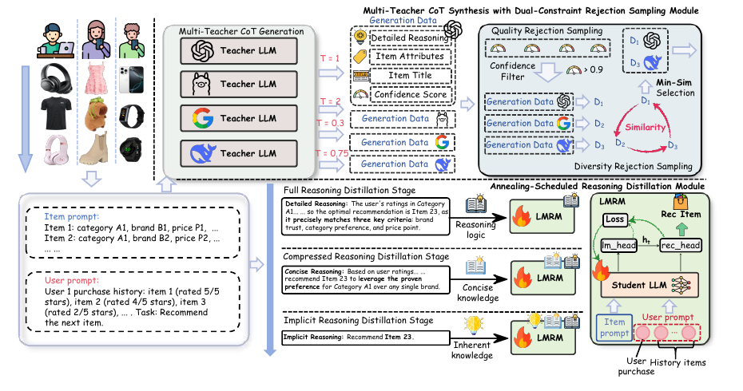

<div align="center">

# Think, But Don't Tell — IRMD

### Autoregressive Full Reasoning

[](https://doi.org/10.1145/3805712.3809758)
[](https://huggingface.co/Qwen/Qwen2.5-1.5B-Instruct)
[](https://huggingface.co/Qwen/Qwen2.5-14B-Instruct-GGUF)
[](https://github.com/HestiaSky/E4SRec)
[](#method)

**Multi-teacher recommendation reasoning → quality and diversity filtering →<br>
Qwen2.5-1.5B autoregressive next-item generation**

</div>

---

This repository contains the **Full Reasoning** implementation used in our
autoregressive IRMD experiments for sequential recommendation. It accompanies:

> Weihai Lu, Xiaoxi Cui, and Chenke Yin.<br>
> *Think, But Don't Tell: Implicit Reasoning for LLM-based Sequential
> Recommendation via Multi-Teacher Distillation.* SIGIR 2026.<br>
> DOI: [10.1145/3805712.3809758](https://doi.org/10.1145/3805712.3809758)

The release focuses on a compact, runnable path from interaction sequences to
teacher reasoning, filtered supervision, student training, and full-catalog
autoregressive evaluation.

## Method

<p align="center">
  
</p>

<p align="center"><em>
Figure 2: The overall architecture of IRMD, including multi-teacher CoT
synthesis, dual-constraint rejection sampling, and annealing-scheduled
reasoning distillation.
</em></p>

### 1. Autoregressive recommendation base

The student is initialized from `Qwen2.5-1.5B-Instruct` and optimized with
P5-style sequential recommendation prompts. The target is generated directly
as a numeric item-ID token sequence.

### 2. Multi-teacher reasoning

Three Qwen2.5-14B configurations generate structured preference, intent, and
evidence chains. Generation is resumable at record granularity, so interrupted
runs continue without duplicating finished samples.

### 3. Reasoning selection

Candidate paths pass through confidence, prediction-correctness, and pairwise
token-cosine diversity gates. The selected paths form the Full Reasoning
supervision corpus.

### 4. Full Reasoning training

The student jointly learns next-item generation and explicit reasoning. During
evaluation, decoding is constrained by a trie containing the complete item-ID
catalog, and previously interacted items are removed from the ranking.

## Repository layout

```text
.
├── irmd_qwen/
│   ├── data.py                      # sequence-corpus loader
│   └── prompts.py                   # teacher and student prompts
├── scripts/
│   └── run_full_reasoning_1000.sh   # end-to-end example recipe
├── pretrain_p5_qwen.py              # autoregressive LoRA base
├── synthesize_irmd_ar_teachers_gguf.py
├── filter_irmd_ar_reasoning.py
├── train_irmd_ar.py                 # Full Reasoning trainer
└── requirements.txt
```

Generated corpora, checkpoints, user subsets, and evaluation outputs are not
included in this repository.

## Data preparation

Download the Amazon Beauty preprocessing from
[HestiaSky/E4SRec](https://github.com/HestiaSky/E4SRec) and arrange it as:

```text
data/full/Beauty/Beauty.txt
data/full/Beauty/Beauty_item2attributes.json
```

The loader retains the original numeric item-ID space so constrained decoding
can operate over the complete catalog.

## Installation

```bash
conda create -n irmd python=3.10 -y
conda activate irmd
pip install -r requirements.txt

# Optional low-memory GGUF teacher runtime
CMAKE_ARGS="-DGGML_CUDA=OFF" pip install llama-cpp-python
```

Models:

- student: [`Qwen/Qwen2.5-1.5B-Instruct`](https://huggingface.co/Qwen/Qwen2.5-1.5B-Instruct)
- teacher: [`Qwen/Qwen2.5-14B-Instruct-GGUF`](https://huggingface.co/Qwen/Qwen2.5-14B-Instruct-GGUF)

## Quick start

Set the path to the first Q4_K_M GGUF shard and run the example recipe:

```bash
export TEACHER_GGUF=/path/to/qwen2.5-14b-instruct-q4_k_m-00001-of-00003.gguf
export DATA_ROOT=$PWD/data/full
export METADATA=/path/to/Beauty.json

bash scripts/run_full_reasoning_1000.sh
```

The recipe performs:

1. Qwen2.5-1.5B LoRA next-item pretraining;
2. three Qwen2.5-14B teacher generation passes;
3. confidence, correctness, and diversity filtering;
4. Full Reasoning continuation training;
5. constrained beam-search evaluation.

All subset sizes and seeds are command-line parameters. The example script
uses a small experimental scale that can be changed before launch.

## Core commands

Generate reasoning candidates:

```bash
PYTHONPATH=. python synthesize_irmd_ar_teachers_gguf.py \
  --model "$TEACHER_GGUF" \
  --data-root "$DATA_ROOT" \
  --dataset Beauty \
  --metadata "$METADATA" \
  --output runs/teacher_reasoning.jsonl \
  --temperatures 0.3 0.7 1.0 \
  --max-examples 300 \
  --condition-on-target
```

Filter teacher reasoning:

```bash
python filter_irmd_ar_reasoning.py \
  --input runs/teacher_reasoning.jsonl \
  --output runs/teacher_reasoning.filtered.jsonl \
  --quality-threshold 0.85 \
  --require-correct \
  --max-per-example 3 \
  --diversity-threshold 0.90
```

Train the Full Reasoning student:

```bash
python train_irmd_ar.py \
  --model Qwen/Qwen2.5-1.5B-Instruct \
  --adapter runs/autoregressive_base \
  --data-root "$DATA_ROOT" \
  --dataset Beauty \
  --metadata "$METADATA" \
  --corpus runs/teacher_reasoning.filtered.jsonl \
  --output runs/full_reasoning \
  --micro-batch-size 1 \
  --gradient-accumulation 16 \
  --reasoning-fraction 1.0 \
  --recommendation-weight 1.0 \
  --reasoning-weight 0.35 \
  --num-beams 20
```

## Configuration notes

- optimizer: AdamW;
- LoRA student training;
- micro-batch size and gradient accumulation are independently configurable;
- teacher generation supports CPU-only GGUF inference;
- decoding uses numeric item IDs and a full-catalog trie;
- runtime artifacts are ignored by Git.

## Citation

```bibtex
@inproceedings{lu2026irmd,
  title     = {Think, But Don't Tell: Implicit Reasoning for LLM-based
               Sequential Recommendation via Multi-Teacher Distillation},
  author    = {Lu, Weihai and Cui, Xiaoxi and Yin, Chenke},
  booktitle = {Proceedings of the 49th International ACM SIGIR Conference on
               Research and Development in Information Retrieval},
  year      = {2026},
  doi       = {10.1145/3805712.3809758}
}
```

## Acknowledgements

This implementation builds on the IRMD method, public Qwen2.5 checkpoints,
and the E4SRec Beauty preprocessing/item-ID space. Please respect the licenses
and terms of each upstream dataset and model.
